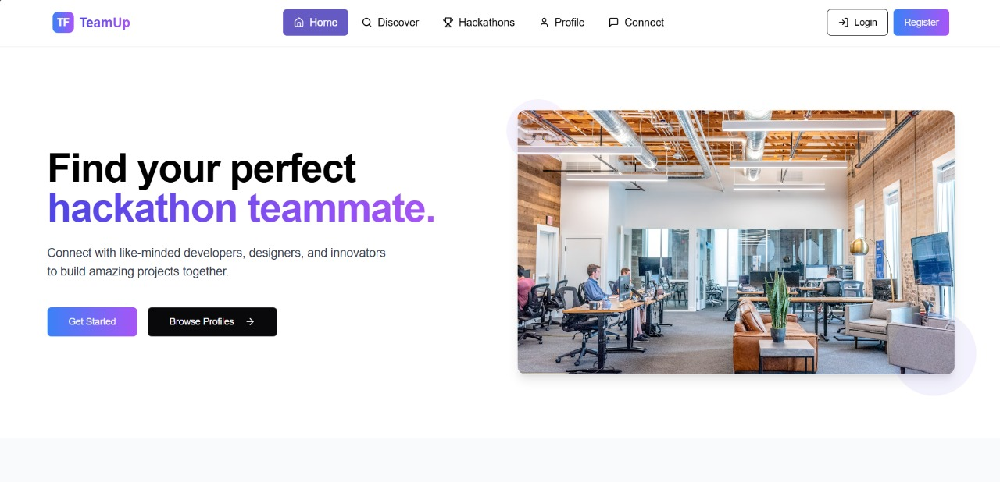
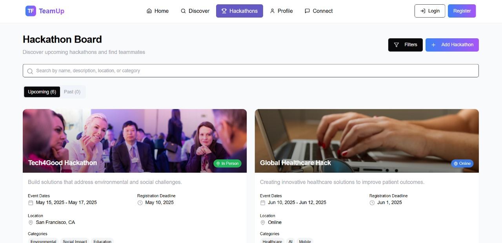
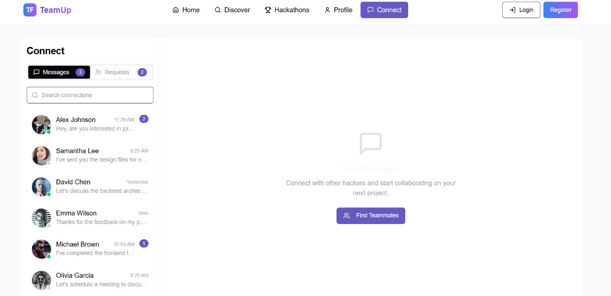

# 🚀 TeamUp

TeamUp is an intuitive web platform designed to help individuals form teams for hackathons, competitions, and collaborative projects. It allows users to share their profiles, explore other developers, and connect with suitable teammates seamlessly.

## 🌟 Features

- 🔍 **Explore Developers** – Browse a curated list of developer profiles based on skills and interests.
- 👥 **Post Your Profile** – Add your own profile to the listing to get noticed by potential teammates.
- 🧩 **Smart Team Matchmaking** – Connect with others who have similar goals or complementary skill sets.
- 🎨 **Immersive Background** – A visually engaging animated background enhances the user experience.
- 📱 **Responsive Design** – Optimized for both desktop and mobile viewing.

## 🛠️ Technologies Used

- **React + TypeScript** – For building a scalable and interactive user interface.
- **Vite** – For fast development and efficient bundling.
- **Tailwind CSS** – For responsive and utility-first styling.
- **ShadCN UI** – For accessible and reusable UI components.
- **@react-three/fiber** – For rendering 3D animations using React.
- **Three.js** – For creating dynamic 3D visual backgrounds.
- **Framer Motion** – For smooth animations and transitions.

## 📌 Use Cases

 -  A developer wants to find a designer for a UI-heavy project in a hackathon.
 -  A beginner is looking for a team that can help guide them through their first event. 
 -  A group of users want to assemble a team based on complementary skills and hackathon interests.

## 📁 Project Structure

teamup/
├── public/
├── src/
│ ├── assets/
│ ├── components/
│ │ ├── BackgroundAnimation.tsx
│ │ └── DeveloperCard.tsx
│ ├── pages/
│ ├── App.tsx
│ └── main.tsx
├── tailwind.config.ts
├── tsconfig.json
├── vite.config.ts
└── README.md

## 📸 Screenshots





## 🧑‍💻 Getting Started

1. **Clone the repo**
   ```bash
   git clone https://github.com/your-username/teamup.git
   cd teamup
2. **Install dependencies**
   npm install --legacy-peer-deps
   
4. **Run the development server**
   npm run dev

## 🤝 Contributing
    Contributions are welcome! Please feel free to open issues or submit pull requests.
    
## 📄 License
    Let me know if you’d like a sample `LICENSE` file or a short GitHub project description as well!

   **Built during a hackathon to solve a real-world challenge of team formation. ✨**
